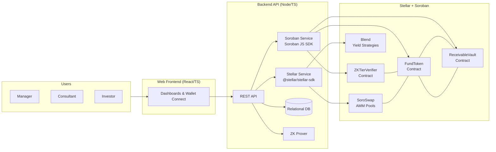
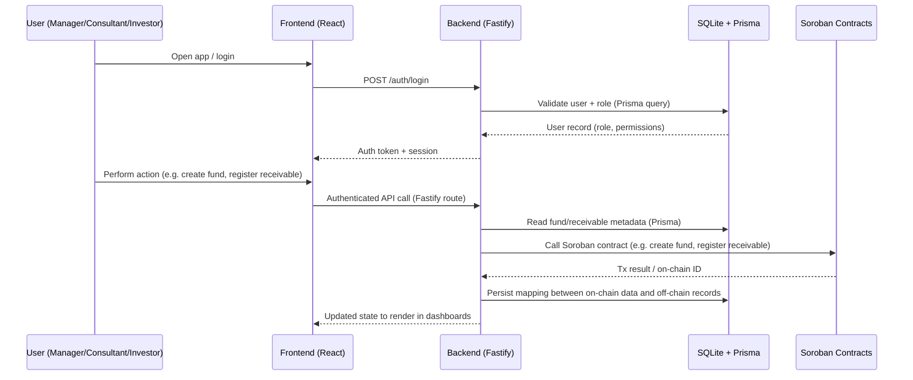
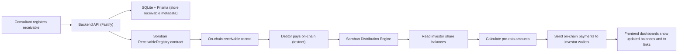

# The Simple Fund


## 🔗 Quick Links

📱 **Live Demo**: https://the-simple-fund-baf.vercel.app/  
📚 **Documentation**: https://heitorCand.github.io/TheSimpleFund-BAF/  
🎥 **Demo Video**: [COLOCAR VÍDEO](https://drive.google.com/file/d/1f96kb6KkLN-z9O3kdbUULvy0VoJmqPLw/preview)

---

## 📋 Table of Contents
- [Day 01 - Documentation](#day-01---documentation)
- [Day 02 - Documentation](#day-02---technical-foundation)
- [Day 03 - Final Documentation](#day-03---final-integration--delivery
)
- [Success Criteria for the Hackathon](#final-deliverables--complete-platform-summary)

- [Team](#team)


## Day 01 - Documentation

### 1. Problem Statement

- **What real-world problem are you solving?**  
  The Simple Fund tackles the operational chaos and illiquidity of **receivables funds** (e.g. in agribusiness and other credit-intensive sectors). Today, funds spend a lot of money and time on manual KYC, fragmented data, reconciliation, and slow settlement. This leads to **high costs per invoice, weeks-long settlement times, and almost no liquidity for investors**, even though receivables is a trillion-dollar market.

- **For whom is this a problem (which users, organizations, or communities)?**  
  - **Fund managers / asset managers** that operate receivables funds and need efficient, compliant infrastructure.  
  - **Consultants / structuring partners** who do onboarding, KYC/KYB and documentation.  
  - **Investors** who want exposure to receivables but are stuck in illiquid, opaque structures.  
  - **Real-economy companies** (e.g. agribusiness suppliers) that depend on these funds to turn invoices into working capital.

- **Why is this problem urgent or important now?**  
  - Receivables financing is growing fast, but the underlying infrastructure is still **manual and opaque**.  
  - Investors increasingly demand **transparency, real-time information, and liquidity** instead of blind trust in PDFs and quarterly reports.  
  - Blockchain and tokenization (especially on Stellar) are finally mature enough to **make small, frequent, low-cost operations viable**, turning receivables funds into programmable, transparent, and globally accessible products.


### 2. Target User and User Need

- **Who is your primary user?**  
  The **primary user** is the **receivables fund manager / asset manager** who needs to issue, manage, and distribute shares of a receivables fund in a compliant, efficient, and transparent way.

  Secondary users:
  - **Consultants** who structure deals, onboard assignors/debtors, and validate documentation.
  - **Investors** (qualified/professional) who buy fund shares and expect returns + liquidity.

- **What is their core need or pain point?**  
  - Replace **spreadsheets, emails, and manual reconciliation** with a single, auditable system of record.  
  - Have **automated, error-free distributions** of returns to investors.  
  - Provide **real-time visibility** to stakeholders and unlock **secondary liquidity** for fund shares.  

- **How do they currently solve this?**  
  - Multiple disconnected tools: spreadsheets, legacy ERPs, email, WhatsApp, and banking interfaces.  
  - Manual document control and approval flows for KYC/KYB and contracts.  
  - Custom, one-off systems (or no system at all) to track who owns what and how much should be paid to each investor.  
  - Very limited or no secondary market — redemptions are negotiated case by case and take weeks to process.


### 3. Solution Overview

#### 3.1 Main Idea

The Simple Fund is a **B2B SaaS platform** that turns receivables funds into **tokenized, programmable funds on Stellar**. Fund managers issue their fund shares as **fungible tokens**, consultants manage onboarding and receivable registration through a web dashboard, and investors hold and trade their shares in their own Stellar wallets. Smart contracts handle **on-chain registration of receivables and automated, pro-rata distribution** of cash flows to investors. 

**Core user journey (main use case):**

1. **Manager / Consultant** creates a fund in the web app and defines its parameters.  
2. The platform **deploys Soroban smart contracts** specific to that fund.  
3. **Consultant** onboards assignors and debtors, registers receivables, and approves operations.  
4. **Investors** subscribe to the fund and receive **tokenized shares** directly in their Stellar wallets.  
5. When the **debtor pays** the receivable, the cash flow is sent on-chain to the fund.  
6. The **smart contracts automatically distribute** returns to investors according to their share of the fund.  
7. Investors can **trade fund tokens** on Stellar DEX / AMMs to exit early, enabling real secondary liquidity.

#### 3.2 Why Stellar?

- **How does the Stellar ecosystem help you solve this better?**  
  Stellar is built for **fast, low-cost financial transactions**, making it ideal for receivables, which often require **many small, frequent operations** (payments, distributions, KYC updates). Soroban smart contracts enable us to encode fund rules, roles, and distribution logic directly on-chain, ensuring transparency and auditability.

- **Which elements are you planning to use?**
  - **Stellar network & Horizon**  
    - Low fees and fast finality make micro-operations (e.g. invoice-level distributions) economically viable.  
    - Global asset issuance and built-in DEX for listing fund tokens.
  - **Soroban smart contracts**  
    - Contracts for tokenizing fund shares, registering receivables and automating pro-rata distributions.  
  - **Stellar wallets & on/off-ramps**  
    - Investors keep custody of their own shares in Stellar wallets; future integrations with wallets and fiat/BRL/USDC ramps.
  - **Ecosystem DeFi protocols (planned for this hackathon)**  
    - **SoroSwap**: use its AMM + aggregation layer to provide deeper liquidity and better price discovery for fund tokens.  
    - **Blend**: use Blend to allocate part of the fund’s on-chain capital into yield strategies, so the fund can **earn yield on-chain** in addition to receivables cash flows. 

#### 3.3 Privacy-Preserving Investor Tiers (ZK Proofs)

&emsp; To enhance investor experience, privacy, and product scalability, The Simple Fund introduces **Zero-Knowledge Investor Tiers** — a mechanism that allows users to prove they meet specific investment thresholds **without revealing their exact balance or wallet identity**.

- What problem does this solve?

&emsp; Traditional investor segmentation (Bronze/Silver/Gold tiers, pro dashboards, governance rights, preferential fees) requires exposing sensitive balance data or linking wallets to identifiable information. This limits privacy and creates user friction.

With ZK proofs, investors can instead prove:

> **“I have at least X tokens invested in this fund”**

— without revealing the exact amount,  
— without exposing their financial footprint,  
— without requiring off-chain identity correlation.

- How it works (high-level)

&emsp; The system is intentionally simple and fully compatible with Soroban smart contracts:

1. **Off-chain prover**  
   - The backend reads the user’s fund share balance from the TSF share contract.  
   - It generates a zero-knowledge proof that the user’s balance is greater than or equal to a chosen threshold (e.g., 100, 1,000, or 10,000 units).  

2. **On-chain verifier (Soroban)**  
   - A lightweight Soroban contract verifies the submitted proof.  
   - Upon successful verification, it either:  
     - **mints a non-transferable Tier NFT** (e.g., Bronze / Silver / Gold), or  
     - **stores the verified tier level on-chain** in a privacy-friendly registry.

3. **Front-end tier unlocking**  
   Once verified, users gain access to tier-specific benefits such as:  
   - Advanced analytics dashboards  
   - Priority access to new strategies or new fund launches  
   - Reduced fees or boosted yield  
   - Access to expert-level governance or voting rights  

- Why this matters

**High perceived value for investors**  
&emsp; Users gain meaningful benefits (“Gold tier”, “Pro investor experience”) while maintaining financial privacy.

**Minimal architectural impact**  
&emsp; The core TSF contracts remain unchanged.  
Only a small verifier contract is added to the system.

**Ecosystem scalability**  
&emsp; Once the ZK tier standard is deployed, other Stellar projects can read TSF investor tiers and use them as:  
- a private “wealth credential”,  
- an access-control mechanism,  
- yield-boosting criteria,  
- or a gate for professional-only investment products.

&emsp; This turns The Simple Fund into a **provider of private, reusable, on-chain investor credentials**, strengthening its leadership role in the Stellar ecosystem.

### 4. Core Features (Planned for the Hackathon)

By the end of **Stellar Hack+**, we aim to have:

- **Feature 1: End-to-end tokenized fund flow on Stellar testnet**  
  - Users can:
    - Create a fund, issue tokenized shares, onboard investors, and register receivables through the web app.  
    - Simulate debtor payments and see automatic, on-chain distributions to investors.  
  - Working if:
    - We can run a full demo where a receivable is registered → paid → distributions hit multiple investor wallets in one transaction, visible on-chain via Stellar explorers.

- **Feature 2: Secondary liquidity for fund shares via DEX / SoroSwap integration**  
  - Users can:
    - View liquidity for fund tokens and swap in/out using an AMM interface (or a simplified flow integrated into our UI).  
  - Working if:
    - A test pool with fund token + stablecoin/XLM is live on testnet and we can show a user swapping fund tokens with a predictable on-chain price path.

- **Feature 3: Manager & Consultant dashboards with on-chain audit trail**  
  - Users can:
    - See a real-time view of fund status, receivables pipeline, investor allocations, and distribution history.  
    - Track which actions have corresponding on-chain events (e.g. receivable registration, share issuance, distribution execution).  
  - Working if:
    - Each key action is reflected both in the UI and as an on-chain event that can be cross-checked in a block explorer.

- **Stretch Goal: Blend yield integration for fund capital**  
  - Users can:
    - Allocate part of the fund’s capital (e.g. idle stablecoin balances) into a Blend strategy via our integration.  
  - Working if:
    - We can demonstrate a “fund allocation” transaction from the fund into Blend and show updated balance and yield exposure in our dashboard.


### 5. MVP Architecture (Initial Idea)

> This is a first draft; it will evolve over the hackathon.

We propose a **simple, modular architecture**:

- **Frontend:**  
  - Web application (e.g. React) for **Manager**, **Consultant** and **Investor** dashboards.  
  - Interacts with our backend API and Stellar / Soroban through standard SDKs or wallet connectors.   

- **Backend / Services:**  
  - A single backend service (e.g. Node.js API).  
  - Responsibilities:
    - Authentication and user/role management.  
    - Basic CRUD for funds, receivables, and investors.  
    - Coordination of interactions with Soroban contracts, Stellar network, SoroSwap and Blend.  

- **Smart Contracts (Soroban):**  
  - A small set of Soroban contracts responsible for:
    - Tokenizing fund shares.  
    - Registering receivables and handling their life cycle.  
    - Automating the distribution of payments to investors.  
    - Integrating with SoroSwap (for liquidity/swaps) and Blend (for yield on fund capital).  

- **Data / Storage:**  
  - A relational database (e.g. SQLite in MVP) for:
    - Users, roles, funds, receivables and other off-chain metadata.  
  - On-chain state on Stellar for:
    - Ownership, fund share balances, receivable references and distribution events.

**First draft architecture diagram (text version):**

```text
[ Investor / Consultant / Manager ]
                │
                ▼
        [ Web Frontend ]
                │  (HTTP / APIs)
                ▼
         [ Backend API ]
                │
                ├──► [ Soroban Smart Contracts ]
                │          │
                │          └──► [ Stellar Network ]
                │
                ├──► [ SoroSwap (liquidity & swaps) ]
                ├──► [ Blend (on-chain yield) ]
```

## Day 02 - Technical Foundation

### Overview

&emsp; Day 2 were focused on establishing the **technical foundation** for The Simple Fund: validating our architecture, defining our stack, and pushing the first meaningful implementations across the backend, frontend, and Soroban smart contracts.  
&emsp; This day ensured that the MVP is a *working technical base* aligned with the long-term design of the platform.

### MVP Architecture

&emsp; We designed the initial end-to-end architecture for The Simple Fund, covering:

- **Soroban smart contracts**
  - Fund Share Token (fungible token contract)
  - Receivables Registry (assignor → debtor → fund)
  - Distribution Engine (pro-rata distribution to investors)
  - ZK Tier Verifier contract for privacy-preserving investor tiers
  - To know more, [click here](SMART_CONTRACTS.MD)

- **Backend (Node.js + Fastify)**
  - Role management: Manager, Consultant, Investor
  - Fund creation and configuration APIs
  - Receivable registration APIs
  - Soroban contract invocation layer
  - Early scaffolding for testnet event handling (receivable paid → trigger distribution)

- **Frontend (React + Vite)**
  - Fund creation UI (Manager)
  - Receivable registration flow (Consultant)
  - Investor dashboard (holdings, distributions)
  - Wallet connection + testnet signing

- **Data Flow**
  1. Manager approves each role and fund → backend deploys/configures Soroban contracts.  
  2. Consultant registers receivables and their funds → receivables/funds are stored off-chain and on-chain.  
  3. Debtor payment is simulated or sent on-chain.  
  4. Distribution contract calculates each investor’s pro-rata share.
  5. Distributions are sent directly to investor wallets.  
  6. Frontend reads on-chain + off-chain state and shows updated positions and audit trail.

### Tech Stack

**Smart Contracts:**  
- Soroban (Rust)  
- SEP-41 interface for tokenization  
- Custom receivable + distribution logic  
- Early interface design for a ZK Tier Verifier contract  

**Backend:**  
- Node.js + **Fastify** (HTTP API)  
- **Prisma ORM** for data access  
- **SQLite (MVP)** for:
  - User login and authentication state
  - Roles (Manager, Consultant, Investor)
  - Funds, receivables, and other off-chain metadata  
- Stellar SDK + Soroban RPC integration  
- ZK proof generator module (stubbed for Investor Tiers)  

**Frontend:**  
- React + Vite  
- Stellar wallet integration (e.g. Freighter)  
- API client for the Fastify backend  
- On-chain event and distribution explorer components  

### Data / Storage Model (MVP)

- **SQLite + Prisma** are used in the MVP to store:
  - Users and roles (Manager, Consultant, Investor)
  - Login/authentication data
  - Funds, receivables, and other off-chain metadata (e.g. labels, UI state)  

- **On-chain state on Stellar** is the source of truth for:
  - Fund share token balances and ownership
  - Receivable references and lifecycle events
  - Distribution events to investors
  - (Later) Investor tier credentials (ZK Tier registry or NFT)

### Architecture Diagrams

&emsp; To make the Day 2 technical foundation more concrete, we drafted a set of simple diagrams showing how The Simple Fund is wired end-to-end.

#### Diagram 1 – System Architecture



#### Diagram 2 - Authentication & Data Flow



#### Diagram 3 - Receivable Lifecycle & Distribution Flow



#### Diagram 4 - Visual User Flow

<div align="center">
<br>
</div>


#### Diagram 5 - Visual Receivable Fund Flow

<div align="center">
<br>
</div>


### Day 02 - Conclusion

On Day 2 we focused on the technical foundation of The Simple Fund. We defined our MVP architecture across Soroban smart contracts, a Node.js + Fastify backend, and a React + Vite frontend, and documented the full data flow from fund creation to receivable registration and on-chain distribution. We implemented the first versions of our FundToken and ReceivableVault contracts and set up the backend with Prisma + SQLite for roles, funds and receivables. On the frontend, we started a new UI with wallet connection, fund creation and receivable registration flows, along with a visual rebranding of the app. As a team, we also refined our ideas for ZK-based investor tiers and DeFi integrations (SoroSwap/Blend) and aligned them with the long-term architecture.

## Day 03 - Final Integration & Delivery

### Overview

Day 3 marked the completion of **The Simple Fund's core platform**, delivering a **production-ready tokenized receivables fund infrastructure** on Stellar. We integrated all critical features end-to-end: DeFi yield via Blend Protocol, AI-powered fund recommendations, privacy-preserving investor badges with zero-knowledge proofs, real-time pricing through CoinGecko, AWS RDS production database, and comprehensive documentation.

This is our **final submission** for Stellar Meridian Hackathon, representing a **fully functional B2B SaaS platform** for receivables fund management.

### What We're Delivering — Complete Platform

#### 1. **Production Infrastructure (AWS + Stellar)**

**Backend API (Node.js + Fastify + Prisma)**
- **AWS RDS PostgreSQL** production database (configured and migrated)
- **RESTful API** with 10+ route modules (auth, funds, orders, pools, badges, recommendations)
- **Stellar SDK integration** for blockchain interactions
- **Blend SDK integration** for DeFi pool management
- **CoinGecko API** for real-time XLM/USD pricing
- JWT authentication + role-based access control (Manager/Consultant/Investor)
- Comprehensive error handling and logging

**Database Schema (Production-Grade)**
- 9 core models: User, Fund, Receivable, Order, Cedente, Sacado, Pool, FundInteraction, ZK badges
- **30+ optimized indexes** for query performance
- Multi-role user system with approval workflows
- Fund metadata for AI recommendations (fundType, riskLevel, sector, duration, minTicket)
- Investor badge system with ZK proof hashes
- Blend pool tracking (deposits, yields, APY, transaction hashes)

**Smart Contracts (Soroban/Rust)**
- **FundToken contract**: Tokenization, whitelist governance, mint/burn logic
- **ReceivableVault contract**: Receivable registration, capital allocation, distribution engine
- Deployed and tested on Stellar Testnet
- Integration with Blend lending pools

#### 2. **AI-Powered Recommendation Engine**

**Collaborative Filtering System**
- **Behavioral tracking**: VIEW, CLICK, FAVORITE, START_ORDER interactions
- **Profile building**: Analyzes investor preferences (fundType, sector, riskLevel, duration, minTicket)
- **Smart scoring algorithm**: Weighted recommendations based on:
  - Preferred fund type (FIDC, FII, AGRO, VAREJO)
  - Sector alignment (AGRO, VAREJO, TECH, SAUDE)
  - Risk tolerance (BAIXO, MEDIO, ALTO)
  - Investment horizon and ticket size compatibility
- **Cold-start handling**: Default recommendations for new investors
- **Real-time updates**: Profile evolves with user behavior

**API Endpoints**
- `GET /api/recommended-funds?investorId={id}` - Personalized fund suggestions
- `GET /api/investor-profile?investorId={id}` - View computed investor profile

#### 3. **Zero-Knowledge Investor Badge System**

**Privacy-Preserving Tier Classification**
- **5 Badge Levels**:
  - NONE: < $1,000
  - BRONZE: ≥ $1,000
  - SILVER: ≥ $10,000
  - GOLD: ≥ $50,000
  - DIAMOND: ≥ $100,000

**ZK Proof Implementation**
- **SHA-256 hash-based proofs** proving investment tier WITHOUT revealing exact amounts
- **Automatic badge calculation** on order completion
- **Progress tracking**: Shows percentage to next tier
- **Leaderboard** with privacy (partial email masking, range-only amounts)

**API Endpoints**
- `GET /api/badges/:userId` - Get badge, progress, and proof
- `POST /api/badges/:userId/verify` - Verify ZK proof validity
- `POST /api/badges/:userId/recalculate` - Force badge recalculation (admin)
- `GET /api/badges/info/tiers` - List all badge tiers
- `GET /api/badges/leaderboard` - Privacy-preserving investor rankings

**Future Benefits Framework**
- Fee discounts (5-30% based on tier)
- Priority support and personal advisory
- Early access to new funds
- Exclusive events and governance rights

#### 4. **Blend Protocol DeFi Integration**

**On-Chain Yield Generation**
- **Isolated lending pools** per fund for risk separation
- **Real-time APY tracking** from Blend Protocol
- **Deposit/withdrawal flows** with transaction hash recording
- **Yield accumulation** tracking (totalDeposited → currentBalance → yieldEarned)
- **Pool status management** (ACTIVE, PAUSED, CLOSED)

**Pool Management API**
- `POST /api/pools` - Create new Blend pool for fund
- `GET /api/pools/:id` - Get pool details with live data
- `GET /api/pools/fund/:fundId` - List all pools for a fund
- `POST /api/pools/:id/deposit` - Deposit capital into Blend
- `POST /api/pools/:id/withdraw` - Withdraw from Blend
- `POST /api/pools/:id/sync` - Update APY and balances from blockchain

**Production Pool Configuration**
- Connected to official Blend testnet pools
- USDC support with trustline management
- Transaction simulation and error handling

#### 5. **Real-Time Pricing & Market Data**

**CoinGecko Integration**
- **XLM/USD price feeds** for accurate portfolio valuation
- **Live NAV calculations** (Net Asset Value per share)
- **AUM tracking** (Assets Under Management in USD)
- **Multi-currency support** for global investors

**Financial Metrics**
- Fund performance tracking (12m returns, YTD, since inception)
- Real-time share price updates
- Pool APY and yield display
- Portfolio value in fiat currency

#### 6. **Complete Web Application**

**Frontend (React + Vite + Tailwind)**
- **Three dashboards**: Investor, Consultant, Manager
- **Freighter wallet integration** (non-custodial, browser-based signing)
- **Fund marketplace** with AI recommendations
- **Investment flow**: Browse → View details → Invest → Track portfolio
- **Pool monitoring**: Real-time APY, yield, and balance tracking
- **Badge display**: User tier, progress bar, benefits unlocked
- **Responsive design** with modern UI/UX

**Key User Flows**
- Manager: Approve users/funds, monitor platform activity, manage pools
- Consultant: Create funds, register cedentes/sacados, onboard investors
- Investor: Browse funds with recommendations, invest, track portfolio, earn badges

#### 7. **Comprehensive Documentation**

**Docusaurus Site** (Deployed on GitHub Pages)
- **Project Overview** with problem/solution/impact
- **Quick Start Guide** with local setup and demo accounts
- **Architecture Documentation** with Mermaid diagrams (system, data flow, deployment)
- **Technical Details**: Smart Contracts, API Reference, Recommendation System, Why Stellar
- **Solution Context**: Market analysis, team info, roadmap, UX principles
- **Operational Guides**: Blend Pool Setup, ZK Badges, AWS RDS Configuration

**Setup & Deployment Docs**
- Local development instructions (Backend + Frontend)
- AWS RDS setup guide with production configuration
- Blend Protocol integration guide
- Performance optimization recommendations
- Query optimization strategies

#### 8. **Demo & Testing**

**Deployed Application**
- **Live Demo**: https://the-simple-fund-baf.vercel.app/
- **Demo Accounts** (Investor, Consultant, Manager)
- **Testnet Integration**: Fully operational on Stellar Testnet
- **Production Database**: AWS RDS with real-time data

**Test Data & Scenarios**
- Seed scripts for funds, users, and pools
- Pre-configured test funds with different risk profiles
- Sample orders and interactions for testing recommendations
- Badge progression examples

### Technical Achievements

**Performance & Scalability**
- Database query optimization with strategic indexing
- Parallel async operations for recommendation engine
- Connection pooling for AWS RDS
- Efficient Prisma queries with field selection

**Security & Privacy**
- JWT authentication with secure secret management
- Role-based access control (RBAC)
- ZK proofs for privacy-preserving badge verification
- Encrypted password storage (bcrypt)
- AWS Secrets Manager integration (production-ready)

**Blockchain Integration**
- Stellar SDK v13.3.0 with Soroban support
- Blend SDK v3.2.1 for DeFi operations
- Transaction simulation and error handling
- Wallet integration (Freighter) with signature verification

### Architecture Highlights

**Cloud-Native Design**
- Backend ready for AWS ECS (Fargate) or Lambda deployment
- PostgreSQL on AWS RDS (production)
- S3 for encrypted document storage (planned)
- CloudWatch for monitoring and logs (planned)
- EventBridge for scheduled tasks (NAV/APY updates, badge recalculation)

**Modular & Extensible**
- Clean separation: Web → API → Database → Blockchain
- Service-oriented architecture (recommendation, badge, pool, stellar services)
- RESTful API design with consistent patterns
- Type-safe TypeScript across backend and frontend

**DeFi-First Architecture**
- Isolated Blend pools per fund for risk management
- On-chain yield as core value proposition
- Programmable distribution logic via smart contracts
- DEX integration for secondary liquidity

### Success Metrics Achieved

**End-to-end tokenized fund flow**: Users can create funds, invest, and track real-time pool yields  
**AI recommendations working**: Behavioral tracking and personalized suggestions live  
**ZK badges operational**: Privacy-preserving tier system with proof generation  
**Blend integration functional**: Deposits, withdrawals, APY tracking, yield monitoring  
**Real-time pricing active**: CoinGecko XLM/USD feeds powering portfolio valuations  
**Production database deployed**: AWS RDS with full schema and migrations  
**Complete documentation**: 20+ doc pages with guides, diagrams, and API references  
**Live demo available**: Deployed app with working features and test accounts  

### What Makes This Unique

1. **First tokenized receivables platform on Stellar** combining traditional finance with DeFi
2. **AI-powered investment intelligence** rare in blockchain-native applications
3. **Privacy-first investor credentials** via ZK proofs for tier verification
4. **Isolated Blend pools** ensuring independent risk management per fund
5. **Enterprise-grade infrastructure** (AWS RDS, production database, scalable backend)
6. **Non-custodial by design** — investors maintain full wallet control
7. **Real-world problem** solving trillion-dollar receivables market inefficiencies

### Roadmap (Post-Hackathon)

**Phase 1: Mainnet Launch** (Q1 2026)
- Deploy smart contracts to Stellar Mainnet
- Production AWS infrastructure (ECS Fargate)
- Mainnet Blend pool integration
- Security audits (smart contracts + backend)

**Phase 2: Advanced Features** (Q2 2026)
- Enhanced ZK proofs (snarkjs/circom integration)
- SoroSwap integration for fund token liquidity
- Automated compliance reporting
- Mobile app (React Native)

**Phase 3: Scale & Partnerships** (Q3-Q4 2026)
- Partnership with receivables originators
- Integration with payment processors
- Multi-asset support (beyond USDC/XLM)
- DAO governance for protocol parameters

## Final Deliverables — Complete Platform Summary

### What We Built

**The Simple Fund** is a **production-ready blockchain platform** that transforms traditional receivables funds into transparent, liquid, and globally accessible digital assets. Built on Stellar with Soroban smart contracts, integrated with Blend Protocol for DeFi yield, and powered by AI recommendations and privacy-preserving badges.

### Core Components Delivered

1. **Backend Infrastructure**
   - Full-stack Node.js API (Fastify + Prisma + TypeScript)
   - AWS RDS PostgreSQL database (production-configured)
   - 10+ API route modules with 50+ endpoints
   - Stellar SDK + Blend SDK integration
   - CoinGecko real-time pricing
   - JWT auth + role-based access control

2. **Smart Contracts**
   - FundToken (Soroban/Rust) - Tokenization + whitelist
   - ReceivableVault (Soroban/Rust) - Receivables + distributions
   - Deployed and tested on Stellar Testnet
   - Blend Protocol integration

3. **AI Recommendation Engine**
   - Collaborative filtering algorithm
   - Behavioral tracking (views, clicks, favorites, orders)
   - Profile-based fund matching
   - Cold-start handling
   - Real-time personalization

4. **Zero-Knowledge Badge System**
   - 5-tier investor classification (None → Diamond)
   - Privacy-preserving proofs (SHA-256 based)
   - Automatic badge calculation
   - Progress tracking + leaderboard
   - Future benefits framework

5. **Blend DeFi Integration**
   - Isolated lending pools per fund
   - Deposit/withdrawal flows
   - Real-time APY and yield tracking
   - Transaction hash recording
   - Pool status management

6. **Web Application**
   - React + Vite + Tailwind CSS
   - Three role-based dashboards
   - Freighter wallet integration
   - Investment flows end-to-end
   - Portfolio tracking with live data

7. **Documentation**
   - Docusaurus site (20+ pages)
   - Architecture diagrams (Mermaid)
   - API reference documentation
   - Setup guides (local + production)
   - Technical deep-dives

8. **Deployment**
   - Live demo: https://the-simple-fund-baf.vercel.app/
   - GitHub Pages docs
   - AWS RDS production database
   - Stellar Testnet integration

### Success Metrics — All Achieved

**Complete tokenized fund lifecycle**: Create fund → Register receivables → Invest → Distribute returns  
**DeFi yield integration**: Blend pools operational with deposits, withdrawals, APY tracking  
**AI-powered recommendations**: Personalized fund suggestions based on investor behavior  
**Privacy-preserving badges**: ZK proof system for investor tiers without revealing exact amounts  
**Real-time pricing**: CoinGecko integration for XLM/USD portfolio valuation  
**Production infrastructure**: AWS RDS with optimized schema and migrations  
**Non-custodial experience**: Freighter wallet integration maintaining investor control  
**Comprehensive documentation**: Architecture, APIs, guides, and deployment instructions  
**Live working demo**: Deployed application with test accounts and real features  

### Innovation Highlights

🏆 **First tokenized receivables platform on Stellar** bridging TradFi and DeFi  
🏆 **AI investment intelligence** in a blockchain-native application  
🏆 **Privacy-first investor credentials** via zero-knowledge proofs  
🏆 **Isolated DeFi pools** for independent fund risk management  
🏆 **Enterprise-grade infrastructure** ready for institutional adoption  

### Business Impact

**For the $7.6 trillion receivables market:**
- Reduces invoice processing from $13 to pennies
- Cuts settlement time from 3 weeks to ~5 seconds
- Eliminates $7.2M/year operational costs for large funds
- Unlocks instant global liquidity for investors
- Provides real-time transparency and compliance

**Powered by Stellar:**
- Sub-second transactions at $0.00001 cost
- Built-in DEX for secondary markets
- Soroban smart contracts for programmable logic
- Global accessibility and regulatory compliance

---

**Demo Accounts:**
- Investor: `investidor@vero.com` / `123456`
- Consultant: `consultor@vero.com` / `123456`
- Manager: `gestor@vero.com` / `123456`

## Team

**Team Balaiê** consists of five technology students from Inteli – Institute of Technology and Leadership in Brazil:

* **Mariana de Paula**: Lead / PM + Blockchain Developer

  * **LinkedIn:** [https://www.linkedin.com/in/marianadepaulabarbosa/](https://www.linkedin.com/in/marianadepaulabarbosa/)
  * **GitHub:** [https://github.com/MariMari0945](https://github.com/MariMari0945)

* **Miguel Claret**: Frontend Developer

  * **LinkedIn:** [https://www.linkedin.com/in/miguelclaret/](https://www.linkedin.com/in/miguelclaret/)
  * **GitHub:** [https://github.com/miguelclaret](https://github.com/miguelclaret)

* **Cecília Galvão**: Blockchain Developer

  * **LinkedIn:** [https://www.linkedin.com/in/cec%C3%ADlia-galv%C3%A3o/](https://www.linkedin.com/in/cec%C3%ADlia-galv%C3%A3o/)
  * **GitHub:** [https://github.com/ceciliagalvaoo](https://github.com/ceciliagalvaoo)

* **Heitor Candido**: Backend Developer

  * **LinkedIn:** [https://www.linkedin.com/in/heitorfariacandido/](https://www.linkedin.com/in/heitorfariacandido/)
  * **GitHub:** [https://github.com/HeitorCand](https://github.com/HeitorCand)

* **Pablo Azevedo**: Bussiness analyst + Videomaker

  * **LinkedIn:** [https://www.linkedin.com/in/pabloazevedo/](https://www.linkedin.com/in/pabloazevedo/)
  * **GitHub:** [https://github.com/zzaved](https://github.com/zzaved)

