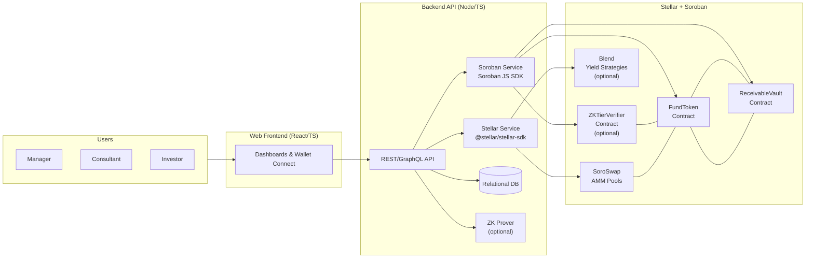
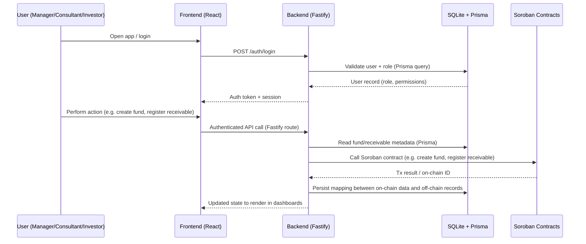

# The Simple Fund


## 📋 Table of Contents
- [Day 01 - Documentation](#day-01---documentation)
- [Team](#team)


## Day 01 - Documentation

### 1. Problem Statement

- **What real-world problem are you solving?**  
  The Simple Fund tackles the operational chaos and illiquidity of **receivables funds** (e.g. in agribusiness and other credit-intensive sectors). Today, funds spend a lot of money and time on manual KYC, fragmented data, reconciliation, and slow settlement. This leads to **high costs per invoice, weeks-long settlement times, and almost no liquidity for investors**, even though receivables is a trillion-dollar market.

- **For whom is this a problem (which users, organizations, or communities)?**  
  - **Fund managers / asset managers** that operate receivables funds and need efficient, compliant infrastructure.  
  - **Consultants / structuring partners** who do onboarding, KYC/KYB and documentation.  
  - **Investors** who want exposure to receivables but are stuck in illiquid, opaque structures.  
  - **Real-economy companies** (e.g. agribusiness suppliers) that depend on these funds to turn invoices into working capital.

- **Why is this problem urgent or important now?**  
  - Receivables financing is growing fast, but the underlying infrastructure is still **manual and opaque**.  
  - Investors increasingly demand **transparency, real-time information, and liquidity** instead of blind trust in PDFs and quarterly reports.  
  - Blockchain and tokenization (especially on Stellar) are finally mature enough to **make small, frequent, low-cost operations viable**, turning receivables funds into programmable, transparent, and globally accessible products.


### 2. Target User and User Need

- **Who is your primary user?**  
  The **primary user** is the **receivables fund manager / asset manager** who needs to issue, manage, and distribute shares of a receivables fund in a compliant, efficient, and transparent way.

  Secondary users:
  - **Consultants** who structure deals, onboard assignors/debtors, and validate documentation.
  - **Investors** (qualified/professional) who buy fund shares and expect returns + liquidity.

- **What is their core need or pain point?**  
  - Replace **spreadsheets, emails, and manual reconciliation** with a single, auditable system of record.  
  - Have **automated, error-free distributions** of returns to investors.  
  - Provide **real-time visibility** to stakeholders and unlock **secondary liquidity** for fund shares.  

- **How do they currently solve this?**  
  - Multiple disconnected tools: spreadsheets, legacy ERPs, email, WhatsApp, and banking interfaces.  
  - Manual document control and approval flows for KYC/KYB and contracts.  
  - Custom, one-off systems (or no system at all) to track who owns what and how much should be paid to each investor.  
  - Very limited or no secondary market — redemptions are negotiated case by case and take weeks to process.


### 3. Solution Overview

#### 3.1 Main Idea

The Simple Fund is a **B2B SaaS platform** that turns receivables funds into **tokenized, programmable funds on Stellar**. Fund managers issue their fund shares as **fungible tokens**, consultants manage onboarding and receivable registration through a web dashboard, and investors hold and trade their shares in their own Stellar wallets. Smart contracts handle **on-chain registration of receivables and automated, pro-rata distribution** of cash flows to investors. 

**Core user journey (main use case):**

1. **Manager / Consultant** creates a fund in the web app and defines its parameters.  
2. The platform **deploys Soroban smart contracts** specific to that fund.  
3. **Consultant** onboards assignors and debtors, registers receivables, and approves operations.  
4. **Investors** subscribe to the fund and receive **tokenized shares** directly in their Stellar wallets.  
5. When the **debtor pays** the receivable, the cash flow is sent on-chain to the fund.  
6. The **smart contracts automatically distribute** returns to investors according to their share of the fund.  
7. Investors can **trade fund tokens** on Stellar DEX / AMMs to exit early, enabling real secondary liquidity.

#### 3.2 Why Stellar?

- **How does the Stellar ecosystem help you solve this better?**  
  Stellar is built for **fast, low-cost financial transactions**, making it ideal for receivables, which often require **many small, frequent operations** (payments, distributions, KYC updates). Soroban smart contracts enable us to encode fund rules, roles, and distribution logic directly on-chain, ensuring transparency and auditability.

- **Which elements are you planning to use?**
  - **Stellar network & Horizon**  
    - Low fees and fast finality make micro-operations (e.g. invoice-level distributions) economically viable.  
    - Global asset issuance and built-in DEX for listing fund tokens.
  - **Soroban smart contracts**  
    - Contracts for tokenizing fund shares, registering receivables and automating pro-rata distributions.  
  - **Stellar wallets & on/off-ramps**  
    - Investors keep custody of their own shares in Stellar wallets; future integrations with wallets and fiat/BRL/USDC ramps.
  - **Ecosystem DeFi protocols (planned for this hackathon)**  
    - **SoroSwap**: use its AMM + aggregation layer to provide deeper liquidity and better price discovery for fund tokens.  
    - **Blend**: use Blend to allocate part of the fund’s on-chain capital into yield strategies, so the fund can **earn yield on-chain** in addition to receivables cash flows. 

#### 3.3 Privacy-Preserving Investor Tiers (ZK Proofs)

&emsp; To enhance investor experience, privacy, and product scalability, The Simple Fund introduces **Zero-Knowledge Investor Tiers** — a mechanism that allows users to prove they meet specific investment thresholds **without revealing their exact balance or wallet identity**.

- What problem does this solve?

&emsp; Traditional investor segmentation (Bronze/Silver/Gold tiers, pro dashboards, governance rights, preferential fees) requires exposing sensitive balance data or linking wallets to identifiable information. This limits privacy and creates user friction.

With ZK proofs, investors can instead prove:

> **“I have at least X tokens invested in this fund”**

— without revealing the exact amount,  
— without exposing their financial footprint,  
— without requiring off-chain identity correlation.

- How it works (high-level)

&emsp; The system is intentionally simple and fully compatible with Soroban smart contracts:

1. **Off-chain prover**  
   - The backend reads the user’s fund share balance from the TSF share contract.  
   - It generates a zero-knowledge proof that the user’s balance is greater than or equal to a chosen threshold (e.g., 100, 1,000, or 10,000 units).  

2. **On-chain verifier (Soroban)**  
   - A lightweight Soroban contract verifies the submitted proof.  
   - Upon successful verification, it either:  
     - **mints a non-transferable Tier NFT** (e.g., Bronze / Silver / Gold), or  
     - **stores the verified tier level on-chain** in a privacy-friendly registry.

3. **Front-end tier unlocking**  
   Once verified, users gain access to tier-specific benefits such as:  
   - Advanced analytics dashboards  
   - Priority access to new strategies or new fund launches  
   - Reduced fees or boosted yield  
   - Access to expert-level governance or voting rights  

- Why this matters

**High perceived value for investors**  
&emsp; Users gain meaningful benefits (“Gold tier”, “Pro investor experience”) while maintaining financial privacy.

**Minimal architectural impact**  
&emsp; The core TSF contracts remain unchanged.  
Only a small verifier contract is added to the system.

**Ecosystem scalability**  
&emsp; Once the ZK tier standard is deployed, other Stellar projects can read TSF investor tiers and use them as:  
- a private “wealth credential”,  
- an access-control mechanism,  
- yield-boosting criteria,  
- or a gate for professional-only investment products.

&emsp; This turns The Simple Fund into a **provider of private, reusable, on-chain investor credentials**, strengthening its leadership role in the Stellar ecosystem.

### 4. Core Features (Planned for the Hackathon)

By the end of **Stellar Hack+**, we aim to have:

- **Feature 1: End-to-end tokenized fund flow on Stellar testnet**  
  - Users can:
    - Create a fund, issue tokenized shares, onboard investors, and register receivables through the web app.  
    - Simulate debtor payments and see automatic, on-chain distributions to investors.  
  - Working if:
    - We can run a full demo where a receivable is registered → paid → distributions hit multiple investor wallets in one transaction, visible on-chain via Stellar explorers.

- **Feature 2: Secondary liquidity for fund shares via DEX / SoroSwap integration**  
  - Users can:
    - View liquidity for fund tokens and swap in/out using an AMM interface (or a simplified flow integrated into our UI).  
  - Working if:
    - A test pool with fund token + stablecoin/XLM is live on testnet and we can show a user swapping fund tokens with a predictable on-chain price path.

- **Feature 3: Manager & Consultant dashboards with on-chain audit trail**  
  - Users can:
    - See a real-time view of fund status, receivables pipeline, investor allocations, and distribution history.  
    - Track which actions have corresponding on-chain events (e.g. receivable registration, share issuance, distribution execution).  
  - Working if:
    - Each key action is reflected both in the UI and as an on-chain event that can be cross-checked in a block explorer.

- **Stretch Goal: Blend yield integration for fund capital**  
  - Users can:
    - Allocate part of the fund’s capital (e.g. idle stablecoin balances) into a Blend strategy via our integration.  
  - Working if:
    - We can demonstrate a “fund allocation” transaction from the fund into Blend and show updated balance and yield exposure in our dashboard.


### 5. MVP Architecture (Initial Idea)

> This is a first draft; it will evolve over the hackathon.

We propose a **simple, modular architecture**:

- **Frontend:**  
  - Web application (e.g. React) for **Manager**, **Consultant** and **Investor** dashboards.  
  - Interacts with our backend API and Stellar / Soroban through standard SDKs or wallet connectors.   

- **Backend / Services:**  
  - A single backend service (e.g. Node.js API).  
  - Responsibilities:
    - Authentication and user/role management.  
    - Basic CRUD for funds, receivables, and investors.  
    - Coordination of interactions with Soroban contracts, Stellar network, SoroSwap and Blend.  

- **Smart Contracts (Soroban):**  
  - A small set of Soroban contracts responsible for:
    - Tokenizing fund shares.  
    - Registering receivables and handling their life cycle.  
    - Automating the distribution of payments to investors.  
    - Integrating with SoroSwap (for liquidity/swaps) and Blend (for yield on fund capital).  

- **Data / Storage:**  
  - A relational database (e.g. SQLite in MVP) for:
    - Users, roles, funds, receivables and other off-chain metadata.  
  - On-chain state on Stellar for:
    - Ownership, fund share balances, receivable references and distribution events.

**High-level architecture diagram (text version):**

```text
[ Investor / Consultant / Manager ]
                │
                ▼
        [ Web Frontend ]
                │  (HTTP / APIs)
                ▼
         [ Backend API ]
                │
                ├──► [ Soroban Smart Contracts ]
                │          │
                │          └──► [ Stellar Network ]
                │
                ├──► [ SoroSwap (liquidity & swaps) ]
                ├──► [ Blend (on-chain yield) ]
```

## Day 02 – Technical Foundation

### Overview

&emsp; Day 2 focused on establishing the **technical foundation** for The Simple Fund — validating our architecture, defining our stack, and pushing the first meaningful implementations across the backend, frontend, and Soroban smart contracts.  
&emsp; This day ensured that the MVP is not just a concept, but a *working technical base* aligned with the long-term design of the platform.

### MVP Architecture (First Draft)

&emsp; We designed the initial end-to-end architecture for The Simple Fund, covering:

- **Soroban smart contracts**
  - Fund Share Token (fungible token contract)
  - Receivables Registry (assignor → debtor → fund)
  - Distribution Engine (pro-rata distribution to investors)
  - (Planned) ZK Tier Verifier contract for privacy-preserving investor tiers
  - To know more, [click here](SMART_CONTRACTS.MD)

- **Backend (Node.js + Fastify)**
  - Role management: Manager, Consultant, Investor
  - Fund creation and configuration APIs
  - Receivable registration APIs
  - Soroban contract invocation layer
  - Early scaffolding for testnet event handling (receivable paid → trigger distribution)

- **Frontend (React + Vite)**
  - Fund creation UI (Manager)
  - Receivable registration flow (Consultant)
  - Investor dashboard (holdings, distributions)
  - Wallet connection + testnet signing

- **Data Flow (high-level)**
  1. Manager approves each role and fund → backend deploys/configures Soroban contracts.  
  2. Consultant registers receivables and their funds → receivables/funds are stored off-chain and on-chain.  
  3. Debtor payment is simulated or sent on-chain.  
  4. Distribution contract calculates each investor’s pro-rata share.
  5. Distributions are sent directly to investor wallets.  
  6. Frontend reads on-chain + off-chain state and shows updated positions and audit trail.

### Tech Stack

**Smart Contracts:**  
- Soroban (Rust)  
- SEP-41 interface for tokenization  
- Custom receivable + distribution logic  
- Early interface design for a ZK Tier Verifier contract  

**Backend:**  
- Node.js + **Fastify** (HTTP API)  
- **Prisma ORM** for data access  
- **SQLite (MVP)** for:
  - User login and authentication state
  - Roles (Manager, Consultant, Investor)
  - Funds, receivables, and other off-chain metadata  
- Stellar SDK + Soroban RPC integration  
- ZK proof generator module (stubbed for Investor Tiers)  

**Frontend:**  
- React + Vite  
- Stellar wallet integration (e.g. Freighter)  
- API client for the Fastify backend  
- On-chain event and distribution explorer components  

### Data / Storage Model (MVP)

- **SQLite + Prisma** are used in the MVP to store:
  - Users and roles (Manager, Consultant, Investor)
  - Login/authentication data
  - Funds, receivables, and other off-chain metadata (e.g. labels, UI state)  

- **On-chain state on Stellar** is the source of truth for:
  - Fund share token balances and ownership
  - Receivable references and lifecycle events
  - Distribution events to investors
  - (Later) Investor tier credentials (ZK Tier registry or NFT)

### 5.1 Architecture Diagrams

&emsp; To make the Day 2 technical foundation more concrete, we drafted a set of simple diagrams showing how The Simple Fund is wired end-to-end.

#### Diagram 1 – High-level System Architecture



#### Diagram 2 - Authentication & Data Flow



#### Diagram 3 - Receivable Lifecycle & Distribution Flow


### 6. Success Criteria for the Hackathon

By the end of Stellar Hack+, we will consider our MVP successful if:

- A user can create a receivables fund, onboard investors, register a receivable, and receive automated on-chain distributions into multiple Stellar wallets on testnet, all via the platform UI.

- We can demonstrate secondary trading of fund shares using Stellar’s DeFi stack (DEX / SoroSwap), with at least one live liquidity pool and a full swap flow in the demo.

- We can measure or show a complete, auditable trail for a full operation (from onboarding → receivable registration → payment → distribution), including:
    - UI state,
    - on-chain events/transactions, and
    - a clear mapping between them that could be used for compliance or external audits.

## Team

**Team Balaiê** consists of five technology students from Inteli – Institute of Technology and Leadership in Brazil:

* **Mariana de Paula**: Lead / PM + Blockchain Developer

  * **LinkedIn:** [https://www.linkedin.com/in/marianadepaulabarbosa/](https://www.linkedin.com/in/marianadepaulabarbosa/)
  * **GitHub:** [https://github.com/MariMari0945](https://github.com/MariMari0945)

* **Miguel Claret**: Frontend Developer

  * **LinkedIn:** [https://www.linkedin.com/in/miguelclaret/](https://www.linkedin.com/in/miguelclaret/)
  * **GitHub:** [https://github.com/miguelclaret](https://github.com/miguelclaret)

* **Cecília Galvão**: Blockchain Developer

  * **LinkedIn:** [https://www.linkedin.com/in/cec%C3%ADlia-galv%C3%A3o/](https://www.linkedin.com/in/cec%C3%ADlia-galv%C3%A3o/)
  * **GitHub:** [https://github.com/ceciliagalvaoo](https://github.com/ceciliagalvaoo)

* **Heitor Candido**: Backend Developer

  * **LinkedIn:** [https://www.linkedin.com/in/heitorfariacandido/](https://www.linkedin.com/in/heitorfariacandido/)
  * **GitHub:** [https://github.com/HeitorCand](https://github.com/HeitorCand)

* **Pablo Azevedo**: Frontend Developer + Videomaker

  * **LinkedIn:** [https://www.linkedin.com/in/pabloazevedo/](https://www.linkedin.com/in/pabloazevedo/)
  * **GitHub:** [https://github.com/zzaved](https://github.com/zzaved)

