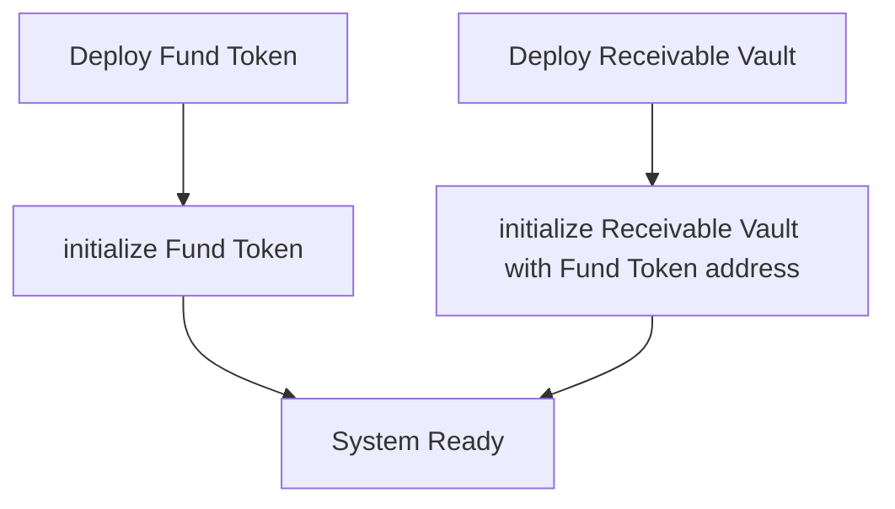
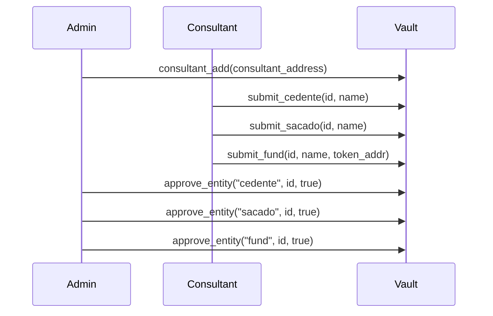
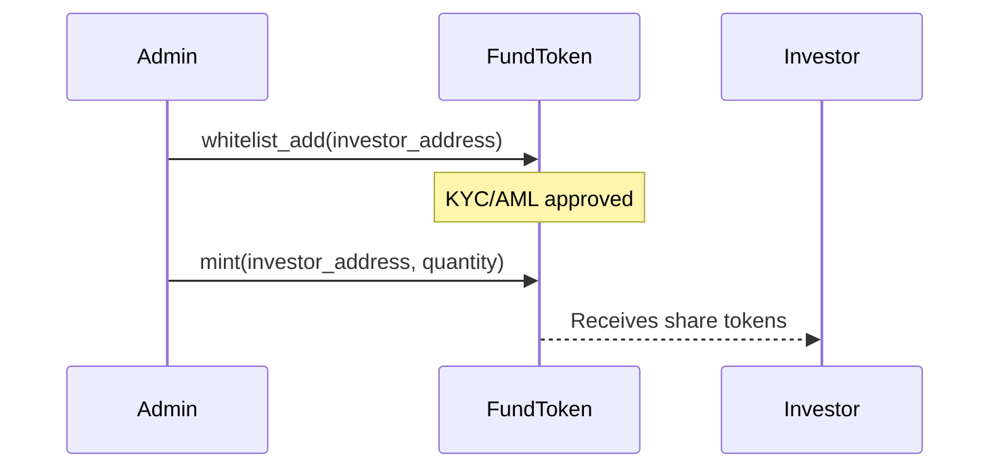
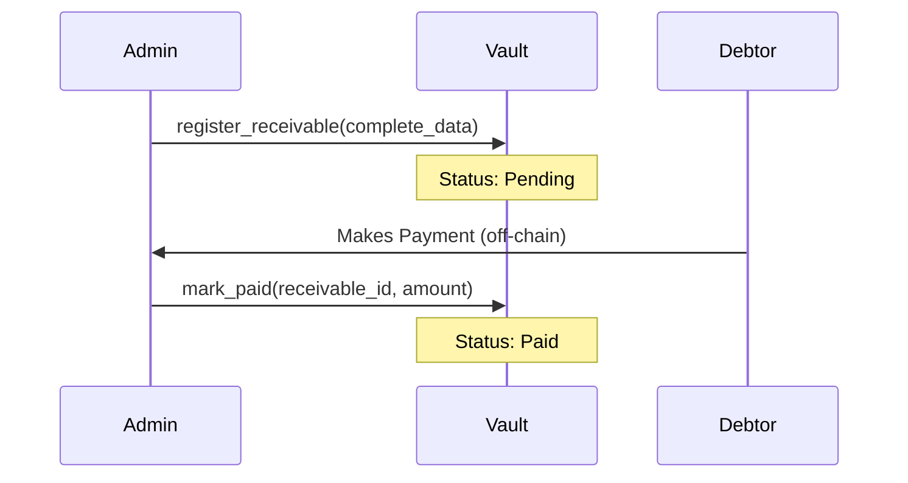
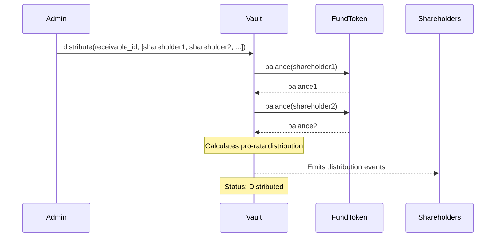
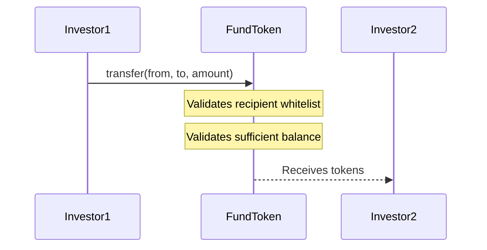

# Smart Contracts - The Simple Fund

This document provides a detailed explanation of the smart contracts developed in Rust for the Stellar blockchain using the Soroban SDK, which form the foundation of The Simple Fund platform.

## Table of Contents

1. [Overview](#overview)
2. [Fund Token Contract](#fund-token-contract)
3. [Receivable Vault Contract](#receivable-vault-contract)
4. [Operational Flow](#operational-flow)
5. [Security and Compliance](#security-and-compliance)


## Overview

The Simple Fund platform utilizes two main contracts written in Rust for Soroban (Stellar):

1. **Fund Token** - Manages fund share tokens with whitelist (KYC/AML)
2. **Receivable Vault** - Manages receivables, funds, and revenue distribution

Both contracts work together to create a receivables tokenization system with integrated compliance.

### Why Two Separate Contracts?

The two-contract architecture was strategically chosen for:

- **Separation of Concerns**: Each contract has a specific and well-defined purpose
- **Reusability**: The same FundToken can be used by multiple funds or pools
- **Modularity**: Facilitates independent upgrades and maintenance of each component
- **Security**: Isolates risks and limits the attack surface of each contract
- **Flexibility**: Allows different token configurations for different types of funds

### Role in The Simple Fund Solution

These contracts are the **technological backbone** of democratizing access to receivables investments:

- **Eliminate traditional intermediaries**: Reduce operational costs and increase transparency
- **Automate processes**: Revenue distribution is mathematical and immediate
- **Ensure compliance**: Integrated whitelist ensures regulatory compliance from design
- **Provide total transparency**: All operations are auditable on-chain
- **Reduce entry barriers**: Tokenization allows fractional investments in receivables that were previously only accessible to large players


## Fund Token Contract

### What is the Fund Token?

The **Fund Token** is a smart contract that implements a regulated digital token, similar to a "security token" or securities token. Each token represents an **ownership share** in a specific receivables fund.

**Real-World Analogy:**
Think of the Fund Token as shares of a traditional investment fund (REIT, for example), but completely digital and on-chain. Just as REIT shares represent fractions of the fund's equity, each Fund Token represents a fraction of a receivables pool.

### Why is the Fund Token Essential to the Solution?

#### 1. **Access Democratization**
- **Fractionalization**: Allows dividing large receivables into thousands of small shares
- **Reduced minimum ticket**: Investors can start with low amounts (e.g., $100)
- **Liquidity**: Tokens can be transferred between whitelisted investors, creating a secondary market

#### 2. **Integrated Compliance (KYC/AML)**
- **Mandatory whitelist**: Only approved investors can receive and transfer tokens
- **Traceability**: Each transfer is recorded on-chain
- **Regulatory compliance**: Meets requirements of SEC, financial regulators
- **Money laundering prevention**: Two-step approval system

#### 3. **Transparency and Auditability**
- **Controlled supply**: Maximum token quantity defined at creation
- **Immutable history**: All transactions are permanently recorded
- **On-chain events**: Each operation emits auditable events
- **Real-time visibility**: Anyone can verify share distribution

#### 4. **Security and Control**
- **Emergency pause**: Admin can pause operations in case of incidents
- **Inflation protection**: Max supply prevents uncontrolled issuance
- **Atomic operations**: Consistency guarantee in all transactions

### Purpose
The **Fund Token** contract implements a customizable token that represents shares of an investment fund. It has whitelist functionalities to ensure compliance with KYC/AML requirements.

### Main Features

#### 1. **Data Structure**
```rust
const DECIMALS: u32 = 7; // Token precision
```

**DataKey** stores:
- `Admin` - Administrator address
- `Name` - Token name
- `Symbol` - Token symbol
- `TotalSupply` - Current total supply
- `MaxSupply` - Maximum allowed supply
- `Balance(Address)` - Balance of each address
- `Whitelist(Address)` - Whitelist status of each address
- `Paused` - Contract pause state

#### 2. **Administration Features**

**Initialization**
```rust
fn initialize(env, admin, name, symbol, max_supply)
```
- Defines the contract administrator
- Configures name, symbol, and maximum supply
- Can only be executed once
- Validations: non-empty name and symbol, positive max_supply

**Whitelist Control (KYC/AML)**
```rust
fn whitelist_add(env, address)      // Add address to whitelist
fn whitelist_remove(env, address)   // Remove address from whitelist
fn is_whitelisted(env, address)     // Check if address is whitelisted
```
- Only admin can add/remove addresses
- Emits events for auditing

**Emergency Pause**
```rust
fn set_pause(env, paused: bool)
```
- Allows pausing/resuming mint and transfer operations
- Useful in emergency situations or maintenance

#### 3. **Token Operations**

**Mint (Token Issuance)**
```rust
fn mint(env, to, amount)
```
- Only admin can execute
- Requires contract not to be paused
- Recipient must be whitelisted
- Validates that it doesn't exceed max_supply
- Increments total_supply and recipient's balance
- Emits mint event

**Transfer**
```rust
fn transfer(env, from, to, amount)
```
- Requires sender authentication
- Contract cannot be paused
- Recipient must be whitelisted
- Validates sufficient sender balance
- Updates sender and recipient balances
- Emits transfer event

#### 4. **Query Functions (Views)**
```rust
fn balance(env, addr) -> i128           // Balance of an address
fn total_supply(env) -> i128            // Total supply
fn max_supply(env) -> i128              // Maximum supply
fn decimals(env) -> u32                 // Decimal places (7)
fn name(env) -> String                  // Token name
fn symbol(env) -> String                // Token symbol
fn admin(env) -> Address                // Admin address
fn is_paused(env) -> bool              // Pause status
```

#### 5. **Error Handling**
```rust
pub enum TokenError {
    AlreadyInitialized = 1,      // Contract already initialized
    NotAdmin = 2,                // Operation requires admin privileges
    Paused = 3,                  // Contract is paused
    NotWhitelisted = 4,          // Address is not whitelisted
    InsufficientBalance = 5,     // Insufficient balance
    SupplyOverflow = 6,          // Would exceed max_supply
    InvalidAmount = 7,           // Invalid amount (zero or negative)
}
```


## Receivable Vault Contract

### What is the Receivable Vault?

The **Receivable Vault** is the central smart contract that functions as the "vault" and management system for all tokenized receivables. It orchestrates the entire lifecycle of financial assets, from origination to payment and revenue distribution.

**Real-World Analogy:**
Think of the Receivable Vault as a **professional fund manager** combined with an **asset registry system** and an **automatic dividend distributor** - all in a single programmable and auditable contract.

### Why is the Receivable Vault Essential to the Solution?

#### 1. **Complete Receivables Lifecycle Management**
- **Origin registration**: Documents who sold (seller/cedente) and who must pay (debtor/sacado)
- **Status tracking**: Tracks receivable from creation to final distribution
- **Fund linkage**: Associates each receivable to the correct fund/pool
- **Complete history**: Maintains immutable record of all stages

#### 2. **Governance and Approval Workflow**
- **Separation of duties**: Consultants propose, managers approve (segregation of duties)
- **On-chain due diligence**: Approval process recorded and auditable
- **Fraud prevention**: Multiple approval system before accepting receivables
- **Responsibility traceability**: Know who proposed each registration

#### 3. **Automated and Fair Revenue Distribution**
- **Pro-rata mathematical calculation**: Eliminates human errors in distribution
- **Real-time snapshot**: Uses current FundToken balances to calculate shares
- **Rounding treatment**: Fair algorithm for residuals
- **Total transparency**: All calculations are verifiable on-chain
- **Cost reduction**: Eliminates intermediaries and manual processes

#### 4. **Fund Token Integration (Cross-Contract)**
- **Inter-contract communication**: Vault queries balances in FundToken
- **Ownership-based distribution**: Who has more tokens receives proportionally more
- **Automatic synchronization**: System works without manual intervention
- **Modular architecture**: Each contract does its part independently

#### 5. **Compliance and Traceability**
- **Registration of all entities**: Sellers and debtors registered and approved
- **Payment history**: Total paid, dates, individual amounts
- **Auditable events**: Each critical operation emits on-chain logs
- **Regulatory compliance**: Meets receivables registrar requirements

#### 6. **Scalability and Operational Efficiency**
- **Multiple funds**: One vault can manage several funds simultaneously
- **Batch processing**: Distribution to hundreds of shareholders in one operation
- **Overhead reduction**: Eliminates traditional bureaucratic processes
- **Automation**: Drastically reduces time between payment and distribution

### Purpose
The **Receivable Vault** contract is the system's core, managing the complete lifecycle of receivables, from entity registration (sellers, debtors, funds) to proportional revenue distribution to shareholders.

### Main Features

#### 1. **Data Structure**

**Entities**
```rust
pub struct EntityRecord {
    pub id: String,              // Tax ID or unique identifier
    pub name: String,            // Entity name
    pub created_by: Address,     // Consultant who proposed
    pub status: Status,          // Pending | Approved | Rejected
}
```

**Funds**
```rust
pub struct FundRecord {
    pub id: String,              // E.g., "FUND-AGRO-001"
    pub name: String,            // Fund name
    pub created_by: Address,     // Consultant who proposed
    pub status: Status,          // Pending | Approved | Rejected
    pub token: Address,          // Associated FundToken address
}
```

**Receivables**
```rust
pub struct Receivable {
    pub id: String,                      // Unique receivable ID
    pub fund_id: String,                 // Associated fund ID
    pub cedente_id: String,              // Seller/cedente ID
    pub sacado_id: String,               // Debtor/sacado ID (payer)
    pub face_value: i128,                // Face value
    pub due_date: u64,                   // Due date
    pub debtor_address: Address,         // Payer address
    pub status: ReceivableStatus,        // Pending | Paid | Distributed
    pub paid_amount: i128,               // Amount actually paid
    pub paid_date: u64,                  // Payment date
}
```

**Status**
```rust
pub enum Status { Pending = 0, Approved = 1, Rejected = 2 }
pub enum ReceivableStatus { Pending = 0, Paid = 1, Distributed = 2 }
```

#### 2. **Permission System**

**Roles**
- **Admin** - Fund manager, approves entities and registers receivables
- **Consultant** - Proposes registrations of sellers, debtors, and funds

**Initialization**
```rust
fn initialize(env, admin, fund_token_address)
```
- Defines the admin and token contract address
- Initializes counters and totalizers

**Consultant Management**
```rust
fn consultant_add(env, addr)        // Add consultant (admin only)
fn consultant_remove(env, addr)     // Remove consultant (admin only)
```

#### 3. **Registrations Proposed by Consultants**

**Seller Submission**
```rust
fn submit_cedente(env, id, name)
```
- Only consultants can execute
- Creates record with `Pending` status
- Awaits admin approval

**Debtor Submission**
```rust
fn submit_sacado(env, id, name)
```
- Same flow as seller
- Identifies the receivables payer

**Fund Submission**
```rust
fn submit_fund(env, id, name, token_addr)
```
- Consultant proposes new fund
- Links to FundToken address
- Awaits admin approval

#### 4. **Entity Approval by Manager**

```rust
fn approve_entity(env, kind, id, approve)
```
- `kind`: "cedente" | "sacado" | "fund"
- `approve`: true (Approved) | false (Rejected)
- Only admin can execute
- Updates entity status
- Emits approval/rejection event

#### 5. **Receivables Management**

**Receivable Registration**
```rust
fn register_receivable(
    env, id, fund_id, cedente_id, sacado_id,
    face_value, due_date, debtor_address
)
```
- Only admin can execute
- Validations:
  - Fund must be approved (`Approved`)
  - Debtor must be approved
  - Seller must exist
  - `face_value` must be positive
- Creates receivable with `Pending` status
- Increments receivables counter

**Payment Marking**
```rust
fn mark_paid(env, id, amount)
```
- Only admin can execute
- Receivable must be in `Pending` status
- Updates:
  - `status` → `Paid`
  - `paid_amount` → paid value
  - `paid_date` → current timestamp
- Increments global `TotalPaid`
- Emits payment event

#### 6. **Pro-Rata Revenue Distribution**

```rust
fn distribute(env, receivable_id, holders)
```
This is one of the most complex and important functions:

**Process:**
1. Validates that receivable is in `Paid` status
2. Retrieves the FundToken associated with the fund
3. **Balance snapshot** - Makes cross-contract call to get each holder's balance
4. **Pro-rata calculation**:
   ```
   share = (holder_balance / total_shares) * paid_amount
   ```
5. **Residue distribution** - Rounding amounts sent to holder with highest balance
6. Updates receivable status to `Distributed`
7. Emits distribution events for each holder

**Features:**
- Fair and transparent distribution
- Mathematical rounding treatment
- Auditable via on-chain events
- MVP: only emits events (production would make actual transfers)

#### 7. **Query Functions (Views)**
```rust
fn get_receivable(env, id) -> Receivable
fn get_receivables_count(env) -> u32
fn get_total_paid(env) -> i128
fn get_fund_token_address(env) -> Address
fn get_admin(env) -> Address
```

#### 8. **Error Handling**
```rust
pub enum VaultError {
    AlreadyInitialized = 1,
    NotAdmin = 2,
    NotConsultant = 3,
    DuplicateId = 4,
    NotFound = 5,
    Invalid = 6,
    BadStatus = 7,
    Math = 8,
}
```


## Operational Flow

### 1. **System Initialization**



**Steps:**
1. Deploy the **Fund Token** contract
2. Initialize Fund Token with admin, name, symbol, and max_supply
3. Deploy the **Receivable Vault** contract
4. Initialize Receivable Vault with admin and Fund Token address

### 2. **Participant Registration**



**Flow:**
1. **Admin** adds consultants to the system
2. **Consultant** submits registrations (sellers, debtors, funds)
3. Registrations remain in `Pending` status
4. **Admin** (manager) approves or rejects each registration
5. Status changes to `Approved` or `Rejected`

### 3. **Share Issuance (Tokenization)**



**Flow:**
1. **Admin** adds investor to whitelist (post-KYC/AML)
2. **Admin** mints tokens for the investor
3. Investor receives their fund shares
4. Tokens can be transferred between whitelisted addresses

### 4. **Receivable Registration and Payment**



**Flow:**
1. **Admin** registers receivable in vault
   - Links to approved fund
   - Links to seller and debtor
   - Defines value and due date
2. Receivable remains in `Pending` status
3. When debtor pays (off-chain or on-chain)
4. **Admin** marks receivable as paid
5. Status changes to `Paid`
6. Value is accounted in `TotalPaid`

### 5. **Revenue Distribution to Shareholders**



**Flow:**
1. **Admin** executes distribution passing list of holders
2. **Vault** makes cross-contract calls to FundToken to get balances
3. Calculates total shares (sum of all balances)
4. For each holder:
   ```
   share = (holder_balance / total_shares) * paid_value
   ```
5. Emits distribution event for each holder
6. Rounding residue goes to holder with highest balance
7. Receivable status changes to `Distributed`

### 6. **Share Transfer Between Investors**



**Flow:**
1. Investor1 initiates transfer
2. **FundToken** validates:
   - Contract is not paused
   - Recipient is whitelisted
   - Sender has sufficient balance
3. Updates both balances
4. Emits transfer event


## Security and Compliance

### 1. **Whitelist (KYC/AML)**
- All mint and transfer recipients must be whitelisted
- Ensures only qualified investors participate
- Compliance with financial regulations

### 2. **Approval System**
- Registrations proposed by consultants
- Centralized approval by manager (admin)
- Traceability of who proposed each registration

### 3. **Access Control (RBAC)**
- **Admin** - Full control, approvals, registrations
- **Consultant** - Can only propose registrations
- **Holders** - Can transfer their shares

### 4. **Emergency Pause**
- Admin can pause token operations
- Useful in case of vulnerabilities or incidents
- Query operations continue to work

### 5. **Supply Limits**
- `max_supply` defined at initialization
- Prevents uncontrolled inflation
- Protects value of existing shares

### 6. **Mathematical Validations**
- Overflow checks in all operations
- Proper handling of mathematical errors
- Helper functions `add()` and `sub()` with protection

### 7. **Auditability**
- All critical events emit on-chain logs
- Complete operation traceability
- Transparency for investors and regulators

### 8. **Critical Data Immutability**
- Admin cannot be changed after initialization
- Receivables maintain status history
- Protection against data manipulation


## Technologies Used

- **Rust** - Programming language
- **Soroban SDK 22.0.0** - Framework for Stellar smart contracts
- **Stellar Blockchain** - Underlying blockchain network
- **Cross-contract calls** - Inter-contract communication (Vault → FundToken)


## Complete Flow Summary

1. **Contract Deployment and Initialization**
2. **Consultant Registration** by admin
3. **Entity Submission** (sellers, debtors, funds) by consultants
4. **Entity Approval** by manager
5. **Whitelist and Share Issuance** for investors
6. **Receivable Registration** by manager
7. **Payment Marking** when debtors pay
8. **Pro-Rata Distribution** of revenues to shareholders
9. **Transfers** of shares between whitelisted investors


## Production Considerations

### MVP vs. Production

**In the current MVP:**
- Distribution only emits events
- Payments are marked manually by admin
- Whitelist managed manually

**For full production:**
- Implement actual stablecoin/USDC transfers in distribution
- Integrate oracles for automatic payment verification
- Automated KYC/AML system
- Self-service interface for consultants and investors
- Performance reports and dashboards
- Decentralized governance via DAO

### Scalability
- Pagination for receivables listing
- Off-chain indexers for complex queries
- Caching of frequently accessed data
- Gas fee optimization

### Additional Compliance
- Automated regulatory reports
- Integration with compliance systems (financial regulators)
- More detailed audit logs
- Dispute resolution system


## Conclusion

The **Fund Token** and **Receivable Vault** smart contracts form a robust and secure infrastructure for receivables tokenization on the Stellar blockchain. The system implements:

- **Compliance** (KYC/AML via whitelist)
- **Clear governance** (roles and approvals)
- **Transparency** (on-chain events)
- **Security** (validations, pauses, limits)
- **Fair distribution** (mathematical pro-rata)

This architecture enables The Simple Fund to democratize access to receivables investments in a secure, transparent, and regulated manner.

