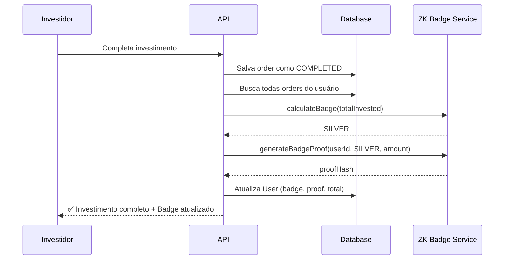

# Sistema de Badges ZK para Investidores

## 🎯 Visão Geral

O sistema de badges ZK (Zero-Knowledge) permite classificar investidores em diferentes níveis baseados no valor total investido na plataforma, **SEM revelar o valor exato** que cada investidor possui.

## 🎖️ Níveis de Badge

| Badge | Valor Mínimo | Ícone | Cor | Benefícios |
|-------|-------------|-------|-----|------------|
| **Nenhum** | < $1,000 | 🆕 | Cinza | Acesso à plataforma |
| **Bronze** | ≥ $1,000 | 🥉 | Bronze | + Relatórios mensais<br>+ Suporte prioritário |
| **Prata** | ≥ $10,000 | 🥈 | Prata | + Análises exclusivas<br>+ Taxa -10%<br>+ Fundos premium |
| **Ouro** | ≥ $50,000 | 🥇 | Ouro | + Consultoria personalizada<br>+ Taxa -20%<br>+ Early access<br>+ Eventos VIP |
| **Diamante** | ≥ $100,000 | 💎 | Azul claro | + Gestor dedicado<br>+ Taxa -30%<br>+ Co-investimento<br>+ Conselho consultivo |

## 🔐 Como Funciona o ZK Proof

### Problema

Em sistemas tradicionais, para verificar se alguém tem determinado badge, seria necessário revelar o valor exato investido:

```
❌ "Você tem $45,000 investidos → Badge Prata"
```

Isso viola a privacidade do investidor.

### Solução ZK

Com Zero-Knowledge Proof, podemos **provar que o investidor tem determinado badge SEM revelar o valor exato**:

```
✅ "Você tem badge Prata (comprovado matematicamente)"
```

O sistema sabe apenas que:
- O investidor investiu ≥ $10,000 (mínimo para Prata)
- O investidor investiu < $50,000 (senão seria Ouro)

Mas **não sabe o valor exato** entre $10k e $50k.

### Implementação

O sistema usa **hash criptográfico SHA-256** para gerar um proof que:

1. **Vincula ao usuário**: usa o `userId` no hash
2. **Prova o badge**: inclui o badge atual
3. **Prova o range**: inclui o threshold mínimo
4. **Evita replay**: adiciona timestamp
5. **Adiciona aleatoriedade**: usa salt randômico

```typescript
const proofData = {
  userId: "user-123",
  badge: "SILVER",
  rangeProof: {
    minThreshold: 10000,
    hasAmount: true  // Prova que tem ≥ $10k sem revelar quanto
  },
  timestamp: 1638360000000,
  salt: "a1b2c3d4e5f6..."
}

const proofHash = SHA256(proofData)
// → "8f5e3a2b1c9d..."
```

## 📊 Atualização Automática

Os badges são atualizados automaticamente quando:

1. **Investidor completa um investimento**
   - Sistema calcula o novo `totalInvested`
   - Recalcula o badge baseado nos thresholds
   - Gera novo ZK proof
   - Atualiza o banco de dados

2. **Admin força recálculo**
   - Via endpoint `/api/badges/:userId/recalculate`

## 🔌 API Endpoints

### 1. Obter Badge do Usuário

```bash
GET /api/badges/:userId
Authorization: Bearer <token>
```

**Resposta:**
```json
{
  "user": {
    "id": "user-123",
    "email": "investor@example.com",
    "totalInvested": 15000,
    "lastBadgeUpdate": "2024-11-22T12:00:00Z"
  },
  "badge": {
    "badge": "SILVER",
    "name": "Prata",
    "minAmount": 10000,
    "color": "#C0C0C0",
    "icon": "🥈",
    "benefits": ["..."],
    "hasProof": true
  },
  "progress": {
    "currentBadge": "SILVER",
    "nextBadge": "GOLD",
    "progressPercentage": 12.5,
    "amountToNext": 35000
  }
}
```

### 2. Verificar ZK Proof

```bash
POST /api/badges/:userId/verify
Authorization: Bearer <token>
```

**Resposta:**
```json
{
  "verified": true,
  "badge": "SILVER",
  "proofHash": "8f5e3a2b1c9d..."
}
```

### 3. Forçar Recálculo (Admin)

```bash
POST /api/badges/:userId/recalculate
Authorization: Bearer <token>
```

### 4. Listar Todos os Tiers

```bash
GET /api/badges/info/tiers
```

### 5. Leaderboard (Privado)

```bash
GET /api/badges/leaderboard
Authorization: Bearer <token>
```

**Resposta:**
```json
{
  "leaderboard": [
    {
      "userId": "user-456",
      "email": "inv***@example.com",  // Email parcialmente oculto
      "badge": {
        "level": "DIAMOND",
        "name": "Diamante",
        "icon": "💎",
        "color": "#B9F2FF"
      },
      "investmentRange": {
        "min": 100000,
        "max": null  // Sem limite superior
      },
      "lastUpdate": "2024-11-22T12:00:00Z"
    }
  ]
}
```

## 🎨 Integração Frontend

### Exemplo React

```typescript
import { useState, useEffect } from 'react';

function UserBadge({ userId }: { userId: string }) {
  const [badge, setBadge] = useState(null);

  useEffect(() => {
    fetch(`/api/badges/${userId}`, {
      headers: { 'Authorization': `Bearer ${token}` }
    })
      .then(res => res.json())
      .then(data => setBadge(data));
  }, [userId]);

  if (!badge) return <div>Loading...</div>;

  return (
    <div className="badge-card">
      <div className="badge-icon" style={{ color: badge.badge.color }}>
        {badge.badge.icon}
      </div>
      <div className="badge-info">
        <h3>{badge.badge.name}</h3>
        <div className="progress-bar">
          <div 
            className="progress-fill" 
            style={{ width: `${badge.progress.progressPercentage}%` }}
          />
        </div>
        <p>{badge.progress.amountToNext.toLocaleString()} até {badge.progress.nextBadge}</p>
      </div>
    </div>
  );
}
```

## 🔒 Segurança e Privacidade

### O que o sistema ZK protege:

✅ **Valor exato investido** não é revelado publicamente  
✅ **Leaderboard** mostra apenas ranges, não valores exatos  
✅ **Email** é parcialmente ocultado no leaderboard  
✅ **Proof hash** valida o badge sem expor dados sensíveis  

### O que ainda é visível:

⚠️ **Badge level** é público (Bronze, Prata, Ouro, Diamante)  
⚠️ **Range mínimo** de cada badge é conhecido  
⚠️ Admins podem ver `totalInvested` no banco de dados  

### Melhorias para produção:

Para um sistema ZK mais robusto em produção, considere:

1. **snarkjs** - Zero-Knowledge Succinct Non-Interactive Argument of Knowledge
2. **circom** - Circuit compiler para ZK proofs
3. **ZoKrates** - Toolbox para ZK proofs na blockchain
4. **StarkNet** - ZK-rollups para escalabilidade

## 📈 Fluxo Completo



## 🧪 Testando

### 1. Completar um investimento

```bash
PATCH /api/orders/:orderId/complete
{
  "txHash": "abc123..."
}
```

### 2. Verificar badge atualizado

```bash
GET /api/badges/:userId
```

### 3. Ver leaderboard

```bash
GET /api/badges/leaderboard
```

## 📝 Próximos Passos

- [ ] Implementar ZK proofs reais com snarkjs
- [ ] Adicionar UI para badges no frontend
- [ ] Criar notificações de upgrade de badge
- [ ] Implementar benefícios automáticos (descontos de taxa)
- [ ] Dashboard de badges para admins
- [ ] Histórico de mudanças de badge
- [ ] Badges NFT (opcional)

## 🤝 Contribuindo

Para adicionar novos badges ou ajustar thresholds, edite:

```typescript
// apps/api/src/services/zkBadge.ts

export const BADGE_THRESHOLDS: BadgeThresholds = {
  [InvestorBadge.BRONZE]: 1000,    // Ajuste aqui
  [InvestorBadge.SILVER]: 10000,   // Ajuste aqui
  [InvestorBadge.GOLD]: 50000,     // Ajuste aqui
  [InvestorBadge.DIAMOND]: 100000, // Ajuste aqui
};
```

---

**Desenvolvido para The Simple Fund - BAF Hackathon 2024** 🚀
