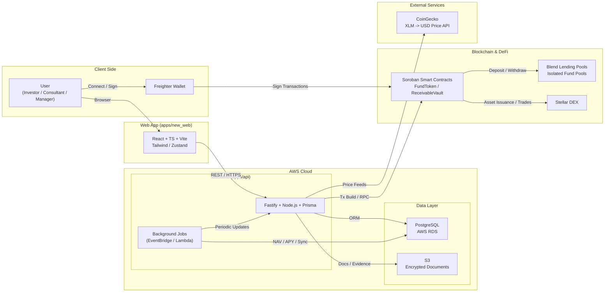

# Solution Architecture

The Simple Fund is built as a modular, scalable, and secure infrastructure for tokenized receivables funds, combining a high-performance backend, a modern web application, non-custodial wallet integration, DeFi yield through Blend, and programmable smart contracts on the Stellar blockchain.  
The backend and database run on AWS, ensuring enterprise-grade reliability, autoscaling, and global availability.

## Overview Diagram

## Main Components

### 1. Frontend (Web App)
- **Tech:** React, TypeScript, Vite, Tailwind CSS, Zustand  
- **Wallet:** Freighter (non-custodial, browser-based signing)  
- **Hosting Options:** Vercel   
- **Structure:** `apps/new_web/`

#### **Key Features**
- Dashboards for Investors, Consultants, and Managers  
- Non-custodial authentication with Freighter  
- Real-time APY, NAV, fund price, and portfolio data  
- **AI-powered fund recommendation engine** (collaborative filtering)  
- Investment and redemption flows  
- **Investor badge system with ZK proofs** (BRONZE → SILVER → GOLD → DIAMOND)  
- Secure API communication with AWS backend  

### 2. Backend (API Server)
- **Tech:** Node.js, TypeScript, Fastify, Prisma  
- **Hosting:** **AWS ECS (Fargate)** or AWS Lambda (serverless)  
- **Networking:** AWS ALB, API Gateway  
- **Secrets:** AWS Secrets Manager  
- **Structure:** `apps/api/`

#### **Responsibilities**
- Authentication, identity validation, and role management  
- CRUD for funds, receivables, cedentes/sacados, orders, pools  
- **Recommendation engine:** personalized fund suggestions based on investor behavior  
- **Investor badge management:** ZK proof generation for tier verification (BRONZE/SILVER/GOLD/DIAMOND)  
- Off-chain logic: approvals, compliance rules, portfolio calculations  
- Integration with:
  - Soroban smart contracts  
  - Blend lending pools (deposit, withdraw, APY, balances)  
  - Freighter wallet signing  
  - CoinGecko (XLM/USD price)  
- Queue/cron tasks for:
  - NAV and APY updates  
  - Pool sync  
  - Price indexing  
  - Risk and exposure calculation  
  - **Badge tier recalculation**  

AWS-native background jobs run via **EventBridge Scheduled Tasks** or **Lambda Cron**.

### 3. Blockchain Layer

#### **Network**
- Stellar Testnet (fully compatible with Mainnet deployment)

#### **Smart Contracts (Soroban — Rust)**
1. **FundToken**
   - Tokenization of fund shares  
   - Whitelist-based governance  
   - Mint/burn logic  
   - Issuance controls  

2. **ReceivableVault**
   - Receivable registration  
   - Allocation of capital into Blend pools  
   - Return distribution  
   - NAV and share-price oracle (via pool balances)  

#### **DeFi Integration — Blend**
Each fund is linked to an **isolated Blend lending pool**, enabling:
- On-chain yield/APY  
- Independent risk domains  
- Programmatic deposits and withdrawals  
- Pro-rata fund valuation  

Contracts are invoked from the backend using Stellar SDK + Soroban RPC.

### 4. Database Layer

- **Engine:** **PostgreSQL** (production) / **SQLite** (development)  
- **Hosting:** **AWS RDS (PostgreSQL)** for production  
- **ORM:** Prisma  
- **Backups:** AWS RDS automated snapshots  
- **Security:** VPC, private subnets, Security Groups  

#### **Responsibilities**
- Persist user, fund, receivable, and operational data  
- Store pool snapshots (APY, yield, balances)  
- Track orders, approvals, and audit logs  
- Track user interactions for recommendation engine  
- Store investor badge system with ZK proofs  
- Provide fast queries for dashboards and analytics  

RDS ensures:
- High availability  
- Automatic backups  
- Point-in-time recovery  
- Failover support  

#### **Database Schema**

**Core Models:**

**User** - Authentication, roles, and investor badge system
- Email, password, role (INVESTIDOR/CONSULTOR/GESTOR)
- Stellar wallet keys (publicKey, secretKey)
- **ZK Badge System:**
  - `totalInvested` - Total amount invested across all funds
  - `investorBadge` - NONE, BRONZE, SILVER, GOLD, DIAMOND
  - `badgeProofHash` - Zero-knowledge proof hash for privacy
  - `lastBadgeUpdate` - Timestamp of last badge calculation
- Approval status for consultants (PENDING/APPROVED/REJECTED)

**Fund** - Tokenized receivables funds
- Basic info: name, symbol, CNPJ, CVM code
- **Governance:** manager, administrator, custodian, auditor
- **Smart contract addresses:** tokenContractId, vaultContractId, fundWalletPublicKey
- **Supply management:** maxSupply, totalIssued, price, NAV
- **Financial metrics:** AUM, returns (12m, YTD, since inception)
- **Risk & compliance:** eligibility, concentration limits, key risks
- **Fees:** administration, management, performance, other
- **Liquidity:** type, lockup days, redemption terms
- **Recommendation metadata:**
  - `fundType` - FIDC, FII, AGRO, VAREJO, OUTROS
  - `riskLevel` - BAIXO, MEDIO, ALTO
  - `sector` - AGRO, VAREJO, TECH, SAUDE, etc.
  - `durationMonths` - Average portfolio maturity
  - `minTicket` - Recommended minimum investment

**Pool** - Blend DeFi integration for yield generation
- `blendPoolAddress` - Address of isolated Blend pool
- `assetAddress` - Underlying asset (USDC, XLM)
- `totalDeposited` - Initial capital deposited
- `currentBalance` - Current balance (deposits + yield)
- `yieldEarned` - Accumulated yield from Blend
- `apy` - Current annual percentage yield
- `depositTxHash` / `withdrawTxHash` - Transaction records
- Status: ACTIVE, PAUSED, CLOSED

**Order** - Investment orders from investors
- Quantity, price, total
- Status: PENDING, COMPLETED, FAILED
- Approval workflow: PENDING_APPROVAL, APPROVED, REJECTED
- Transaction hashes: txHash, refundTxHash, tokenMintTxHash
- Links to investor and fund

**Cedente** - Receivable originators (sellers)
- Company details: name, CNPJ, fantasy name, CNAE
- Contact: email, phone, address, city/state/country
- Financial: revenue, total debt, main banks, risk rating
- KYC/Compliance: beneficial owners, isPep flag
- Credit analysis: credit policy, guarantees, operation description
- Approval status

**Sacado** - Debtors (payers of receivables)
- Company/person details: name, CPF/CNPJ, type
- Contact information
- Credit metrics: rating, payment history, exposure
- Default rates: 30d, 60d, 90d
- Concentration: credit limit, percentage of fund
- Approval status

**Receivable** - Individual receivables in fund portfolio
- Face value, due date
- Status: PENDING, PAID, DISTRIBUTED
- Payment tracking: paidValue, paidAt
- Links to fund and sacado

**FundInteraction** - User behavior tracking for recommendations
- `investorId`, `fundId`
- `type` - VIEW, CLICK, FAVORITE, START_ORDER
- `createdAt` - Timestamp for interaction analysis

**Indexing Strategy:**
- Role-based queries: `role`, `status`, `role + status`
- Financial queries: `totalInvested`, `investorBadge`, `price`
- Recommendation queries: `fundType`, `riskLevel`, `sector`, composite indexes
- Interaction tracking: `investorId`, `fundId`, `type`, `createdAt`
- Time-series: `createdAt`, `updatedAt`, `lastYieldUpdate`

For complete schema details, see [`apps/api/prisma/schema.prisma`](../../../apps/api/prisma/schema.prisma).  

### 5. DevOps & Cloud Infrastructure

- **Containerization:** Docker  
- **Orchestration:** AWS ECS (Fargate)  
- **CI/CD:** GitHub Actions + AWS CodeDeploy  
- **Storage:** AWS S3 (documents, encrypted off-chain files)  
- **Secrets:** AWS Secrets Manager  
- **Monitoring:** AWS CloudWatch (logs, metrics, alarms)  
- **Cron Jobs:** AWS EventBridge (scheduled tasks)  
- **Networking:** AWS VPC, subnets, load balancers  

This setup ensures performance, fault tolerance, and scalability for production workloads.

## Key Architectural Principles
- **Non-custodial by design:** Investors keep full control through Freighter  
- **Modular structure:** Web App, API, Contracts, and DeFi layers are decoupled  
- **Cloud-native scalability:** autoscaling, load balancing, background schedulers  
- **Security-first:** encrypted data, secret isolation, IAM policies, role-based access  
- **Transparency:** on-chain events + off-chain audit logs  
- **Resilience:** isolated Blend pools, RDS backups, distributed architecture  

## Folder Structure Highlights
- `apps/new_web/` — Frontend (React + Freighter)  
- `apps/api/` — Backend (Fastify + Prisma + AWS services)  
  - `src/services/recommendationService.ts` — Collaborative filtering engine  
  - `src/routes/recommendation.ts` — Recommendation API endpoints  
  - `src/routes/fundInteraction.ts` — User behavior tracking  
  - `src/routes/badge.ts` — ZK badge management  
  - `src/routes/pool.ts` — Blend pool integration  
- `contracts/` — Smart contracts (Rust/Soroban)  
  - `fund-token/` — FundToken contract (tokenization + whitelist)  
  - `receivable-vault/` — ReceivableVault contract (receivables + distribution)  
- `docs/` — Documentation (Docusaurus)  
- `prisma/` — Database schema and migrations  
- `scripts/` — Seeds, migrations, automation  

This cloud-native architecture enables secure, scalable, and production-ready infrastructure for managing tokenized receivables funds with **on-chain yield, real-time pricing, global liquidity, institutional-grade compliance, AI-powered recommendations, and privacy-preserving investor badges**, powered by Stellar, Blend, and AWS.
