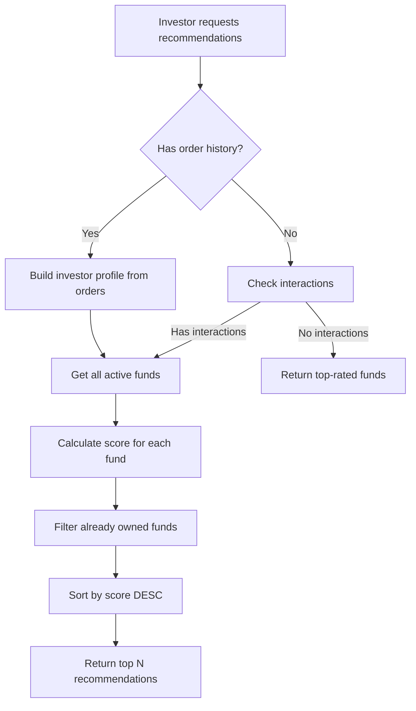

# Recommendation System

The Simple Fund implements an intelligent **collaborative filtering recommendation engine** that personalizes fund discovery for investors based on their interaction history and investment preferences.

## Overview

The recommendation system analyzes investor behavior and past investments to suggest funds that align with their profile, improving user experience and increasing investment conversion rates.

### Key Features
- **Collaborative Filtering** - Recommends funds based on similar investor profiles
- **Weighted Scoring** - Multiple factors contribute to recommendation quality
- **Behavioral Tracking** - Tracks views, clicks, favorites, and order starts
- **Cold Start Handling** - Falls back to top-rated funds for new investors
- **Real-time Updates** - Profiles update instantly as investors interact

## Architecture

### Database Schema

#### Fund Metadata (for Recommendations)
```prisma
model Fund {
  // ... existing fields ...
  
  // Recommendation metadata
  fundType        String  @default("FIDC")    // FIDC, FII, AGRO, VAREJO, OUTROS
  riskLevel       String?                     // BAIXO, MEDIO, ALTO
  sector          String?                     // AGRO, VAREJO, SAUDE, TECH, etc.
  durationMonths  Int?                        // Average portfolio maturity
  minTicket       Float?                      // Recommended minimum investment
  
  fundInteractions FundInteraction[]
}
```

#### Interaction Tracking
```prisma
model FundInteraction {
  id         String   @id @default(cuid())
  investorId String
  fundId     String
  type       String   // VIEW, CLICK, FAVORITE, START_ORDER
  createdAt  DateTime @default(now())
  
  investor   User     @relation(fields: [investorId], references: [id])
  fund       Fund     @relation(fields: [fundId], references: [id])
}
```

**Interaction Types:**
- `VIEW` - Investor viewed fund details page
- `CLICK` - Investor clicked on fund card
- `FAVORITE` - Investor added fund to favorites
- `START_ORDER` - Investor initiated investment order


## Scoring Algorithm

The recommendation engine uses a **weighted scoring system** that compares investor profiles against fund attributes:

### Scoring Weights
```typescript
fundType       → +3 points (highest priority)
sector         → +3 points (highest priority)
riskLevel      → +2 points (medium priority)
durationMonths → +1 point  (low priority)
minTicket      → +1 point  (low priority)
```

### Profile Building Logic

The system builds an investor profile by analyzing their **order history** and **interactions**:

1. **Order Analysis** - Examines all completed investments
   - Identifies most frequent `fundType`, `sector`, `riskLevel`
   - Calculates average `durationMonths` and `minTicket` preferences

2. **Weighted Interactions** - Recent activity influences profile
   - `START_ORDER` interactions have highest weight
   - `FAVORITE` and `CLICK` interactions have medium weight
   - `VIEW` interactions provide baseline signals

3. **Preference Aggregation**
   - Most common values across orders become profile preferences
   - System adapts as investor makes new investments

### Recommendation Flow



## API Endpoints

### 1. Get Recommended Funds
**Endpoint:** `GET /api/recommended-funds`

**Query Parameters:**
- `investorId` (required) - User ID of the investor

**Request Example:**
```bash
curl "http://localhost:3001/api/recommended-funds?investorId=clxyz123"
```

**Response:**
```json
[
  {
    "id": "fund-001",
    "name": "Agro Export FIDC",
    "symbol": "AGRO-EXP",
    "fundType": "FIDC",
    "riskLevel": "MEDIO",
    "sector": "AGRO",
    "durationMonths": 12,
    "minTicket": 10000,
    "price": 1.05,
    "totalIssued": 5000,
    "maxSupply": 10000,
    "score": 8,
    "reason": "Matches: fundType (FIDC), sector (AGRO), riskLevel (MEDIO)"
  }
]
```

**Response Fields:**
- `score` - Compatibility score (0-10, higher is better)
- `reason` - Human-readable explanation of why the fund was recommended

### 2. Get Investor Profile
**Endpoint:** `GET /api/investor-profile`

**Query Parameters:**
- `investorId` (required) - User ID of the investor

**Request Example:**
```bash
curl "http://localhost:3001/api/investor-profile?investorId=clxyz123"
```

**Response:**
```json
{
  "profile": {
    "preferredFundType": "FIDC",
    "preferredSector": "AGRO",
    "preferredRiskLevel": "MEDIO",
    "avgDuration": 12,
    "avgTicket": 15000
  }
}
```

### 3. Track Fund Interaction
**Endpoint:** `POST /api/funds/:fundId/interactions`

**Body Parameters:**
- `investorId` (required) - User ID
- `type` (required) - Interaction type: `VIEW`, `CLICK`, `FAVORITE`, `START_ORDER`

**Request Example:**
```bash
curl -X POST "http://localhost:3001/api/funds/fund-001/interactions" \
  -H "Content-Type: application/json" \
  -d '{
    "investorId": "clxyz123",
    "type": "FAVORITE"
  }'
```

**Response:**
```json
{
  "ok": true,
  "interaction": {
    "id": "int-001",
    "type": "FAVORITE",
    "createdAt": "2025-11-22T10:30:00Z"
  }
}
```

### 4. Get Fund Interactions (Analytics)
**Endpoint:** `GET /api/funds/:fundId/interactions`

Returns all interactions for a specific fund with aggregated statistics.

**Response:**
```json
{
  "interactions": [...],
  "stats": {
    "total": 150,
    "byType": {
      "VIEW": 80,
      "CLICK": 40,
      "FAVORITE": 20,
      "START_ORDER": 10
    },
    "uniqueInvestors": 45
  }
}
```

### 5. Get Investor Interactions
**Endpoint:** `GET /api/investors/:investorId/interactions`

Returns all interactions for a specific investor.

**Response:**
```json
{
  "total": 25,
  "interactions": [
    {
      "id": "int-001",
      "type": "VIEW",
      "createdAt": "2025-11-22T09:00:00Z",
      "fund": {
        "id": "fund-001",
        "name": "Agro Export FIDC",
        "symbol": "AGRO-EXP",
        "fundType": "FIDC",
        "sector": "AGRO"
      }
    }
  ]
}
```

## Implementation Details

### Service Layer
**File:** `apps/api/src/services/recommendationService.ts`

**Key Functions:**
- `buildInvestorProfile(investorId)` - Analyzes order history to build profile
- `getCandidateFunds(investorId)` - Filters out already owned funds
- `scoreFund(fund, profile)` - Calculates compatibility score
- `buildReason(fund, profile)` - Generates human-readable explanation
- `getRecommendedFunds(investorId)` - Main function returning ranked recommendations

### Routes
**Files:**
- `apps/api/src/routes/recommendation.ts` - Recommendation endpoints
- `apps/api/src/routes/fundInteraction.ts` - Interaction tracking endpoints


## Example Scenarios

### Scenario 1: New Investor (Cold Start)
**Profile:** No orders, no interactions  
**Result:** Returns top-rated active funds (sorted by total issued or other metrics)

### Scenario 2: FIDC Investor
**Profile:**
- 3 past investments in FIDC funds
- Sector: AGRO (2x), VAREJO (1x)
- Risk: MEDIO

**Recommended:**
1. FIDC AGRO funds (score: 8-9)
2. FIDC VAREJO funds (score: 6-7)
3. Other AGRO funds (score: 3-5)

### Scenario 3: Diversified Investor
**Profile:**
- Mixed investments across FIDC, FII, AGRO
- Multiple risk levels

**Recommended:**
- Balanced mix of fund types matching historical preferences
- New sectors with similar risk profile


## Future Enhancements

### Planned Features
- **Machine Learning Models** - Replace rule-based scoring with ML predictions
- **Social Proof** - "Investors similar to you also invested in..."
- **Performance-based Weighting** - Prioritize funds with better historical returns
- **Time Decay** - Recent interactions weight more than older ones
- **A/B Testing** - Experiment with different scoring algorithms
- **Personalized Filters** - Let investors set explicit preferences (ESG, sectors, etc.)


## Performance Considerations

- **Database Indexes** - All query fields are indexed:
  - `fundType`, `riskLevel`, `sector`
  - `investorId`, `fundId`, `type` on FundInteraction
  - Composite indexes on status + recommendation fields

- **Caching Strategy** - Consider caching profiles for active investors (Redis/Memcached)

- **Batch Processing** - For large platforms, precompute recommendations via background jobs

## Conclusion

The recommendation system transforms The Simple Fund platform into an intelligent investment discovery tool that learns from investor behavior and preferences. By combining collaborative filtering with weighted scoring across multiple fund attributes, the system delivers personalized recommendations that improve conversion rates and user experience. The behavioral tracking infrastructure not only powers recommendations but also provides valuable analytics for fund managers to understand investor interests and optimize their offerings. As the platform grows, the recommendation engine will continuously improve its accuracy, making fund discovery more efficient and helping investors find opportunities that truly align with their investment profiles.


